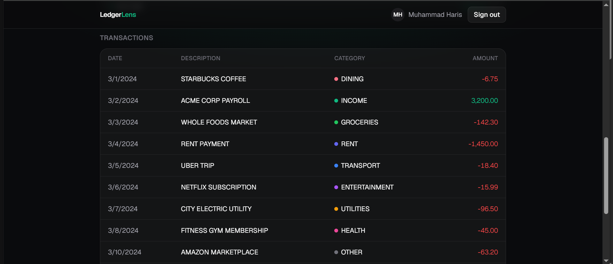
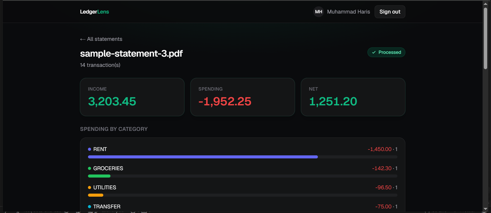

# LedgerLens

Upload a bank or credit-card statement PDF and asynchronously parse, categorize, and surface
spending insights.

**Live demo:** https://ledger-lens-eosin.vercel.app

> Sign in with Google, upload a statement PDF, and watch it process from `queued → processing →
> processed` into a categorized transaction table with a spending-by-category breakdown.

## Screenshots

<!-- Add the images under ./docs/ and they'll render here. -->

**Statement detail — categories + metric cards**



**Spending by category**



## What it does

1. You upload a statement PDF.
2. The file is stored and a background job is enqueued — the request returns immediately (`202`).
3. A signature-verified worker extracts text, parses transactions, and asks an LLM to categorize
   each one.
4. Transactions are persisted with their categories, and the UI (which has been polling) shows the
   result: a transaction table and a spending-by-category breakdown.

## Architecture

Event-driven and asynchronous — the upload request does no heavy work itself:

```
Browser ──upload──▶ POST /api/statements
                      ├─ store raw PDF ─────────────▶ Vercel Blob
                      ├─ create Statement + Job ────▶ Neon (Postgres/Prisma)
                      └─ publish {statementId, jobId} ▶ QStash  ──HTTP POST──▶ POST /api/worker/process
                                                                                 ├─ verify QStash signature
                                                                                 ├─ Redis SET NX (idempotency)
                                                                                 ├─ fetch PDF ◀── Vercel Blob
                                                                                 ├─ extract (unpdf) → parse
                                                                                 ├─ categorize ──▶ Gemini
                                                                                 ├─ persist txns + PROCESSED (atomic)
                                                                                 └─ delete blob
Browser ──poll──▶ GET /api/statements/[id]/status ──▶ queued → processing → processed
```

Key properties: the queue message carries **ids only** (never file bytes, text, or the blob URL);
the worker is the only place heavy work runs; failures are classified **transient** (retry) vs
**permanent** (fail gracefully); and the blob is deleted once processing reaches a terminal state.
See `./docs/architecture.png` for the full diagram.

## Tech stack

- **Framework:** Next.js (App Router), React 19, TypeScript (strict), Tailwind CSS v4
- **Database:** Neon (Postgres) + Prisma
- **Auth:** Auth.js v5 (Google OAuth, database sessions)
- **AI:** Google Gemini (`gemini-2.5-flash`)
- **Async infra:** Upstash QStash (publish + signature-verifying Receiver), Upstash Redis
  (idempotency marker + per-user rate limit)
- **Storage:** Vercel Blob (raw PDF, deleted after processing)
- **Testing:** Vitest
- **CI/CD:** GitHub Actions (lint · typecheck · test), deployed on Vercel

## The four things this project demonstrates

- **Automated testing.** A CI gate (lint → typecheck → test) runs on every push and PR; branch
  protection keeps `main` green. Tests mock external boundaries so they're deterministic and
  credential-free, with pure logic (money parsing, metrics, ownership) unit-tested directly.
- **Event-driven async processing.** Upload enqueues and returns `202`; a QStash-driven worker does
  the work idempotently, with explicit transient-vs-permanent failure semantics and at-least-once
  delivery handled via a Redis marker + a DB status guard.
- **LLM evaluation + observability.** A labeled synthetic dataset scores the categorizer with
  accuracy, per-category precision/recall/F1, macro-F1, and a confusion matrix; each call records
  latency, token counts, and an estimated cost. Model choices are made from measurements, not vibes.
- **Security-by-design.** A single ownership invariant (404, never 403), mandatory QStash signature
  verification before any work, PII-safe logging (ids/status only), and minimized, unguessable,
  short-lived blobs.

## Security highlights

See [`docs/threat-model.md`](./docs/threat-model.md). Highlights:

- **Ownership invariant** — every read is scoped by `userId`; a resource you don't own returns
  **404, not 403** (no existence leak).
- **QStash signature verification** — the public worker endpoint verifies the request signature
  before doing anything; an unsigned/forged request is rejected.
- **PII-safe logging** — file bytes, extracted text, amounts, and blob URLs are never logged; only
  ids, status, stage, and metrics.
- **Minimized blobs** — raw PDFs use unguessable capability URLs and are deleted once processing
  reaches a terminal state.
- **Rate limiting** — per-user upload rate limit (Redis sliding window), fail-open on outage.

## Evaluation

See [`docs/evaluation.md`](./docs/evaluation.md). The categorizer is measured against a hand-labeled
**synthetic** dataset (including deliberately adversarial, ambiguous merchants) using accuracy and
**macro-F1**. It scores **~96% macro-F1**. A measured thinking-on/off experiment showed no quality
difference with model "thinking" disabled while cutting latency ~53% and cost ~55% — so the worker
runs with thinking off. The scoring math is pure and unit-tested in CI; the real (non-deterministic,
paid) LLM run is an offline `npm run eval`, not a CI gate.

## Known limitations

Honest scope boundaries for a portfolio project:

- **One statement format.** The parser handles a single documented line format; other/multi-bank
  formats are out of scope (robust multi-format parsing via the LLM is future work). Unrecognized
  input **fails gracefully** — the statement is marked `FAILED` with a friendly message, never a
  crash.
- **Public capability-URL blobs.** Vercel Blob objects are public but use an unguessable random
  suffix and are deleted after processing. A hardened production system would use signed,
  short-lived URLs.
- **Neon free-tier cold starts.** The database compute auto-suspends when idle, so the first request
  after a lull can be slow (occasionally slow enough to feel like a hang before it wakes).

## Local setup

### Prerequisites

- Node.js 20.17+ and npm
- Accounts/keys: Neon (Postgres), Google OAuth client, Upstash QStash **and** Redis, Vercel Blob,
  Google Gemini (AI Studio)

### Configure

```bash
npm install
cp .env.example .env.local   # then fill in the values (see .env.example for the full list)
```

`.env.local` holds (names only — see [`.env.example`](./.env.example)): `DATABASE_URL` + `DIRECT_URL`
(Neon), `AUTH_SECRET`, `GOOGLE_CLIENT_ID` + `GOOGLE_CLIENT_SECRET`, `GEMINI_API_KEY`, `QSTASH_TOKEN`
+ `QSTASH_CURRENT_SIGNING_KEY` + `QSTASH_NEXT_SIGNING_KEY` (+ `QSTASH_URL` for local only, see below),
`UPSTASH_REDIS_REST_URL` + `UPSTASH_REDIS_REST_TOKEN`, `BLOB_READ_WRITE_TOKEN`.

Apply the database schema (uses Neon's direct connection):

```bash
npm run db:migrate          # local dev migrations
```

### Run the app + worker locally

The worker is invoked by QStash. Locally, cloud QStash can't reach `localhost`, so run the QStash
**local dev server** and point the app at it:

```bash
npx @upstash/qstash-cli dev   # prints a local QSTASH_URL, token, and signing keys
```

Copy those dev values into `.env.local` — set `QSTASH_URL=http://127.0.0.1:8080` plus the dev token
and signing keys. (In **production** the opposite is true: leave `QSTASH_URL` **unset** so the client
uses Upstash cloud, and use the cloud token/keys.) Then:

```bash
npm run dev                 # http://localhost:3000
```

Sign in, upload `samples/sample-statement-2.pdf`, and watch it process.

### Tests and evaluation

```bash
npm run lint                # ESLint
npm run typecheck           # tsc --noEmit
npm run test                # Vitest (mocked boundaries, no creds needed)
npm run eval                # offline LLM eval → eval/report.md (needs a real GEMINI_API_KEY)
```
